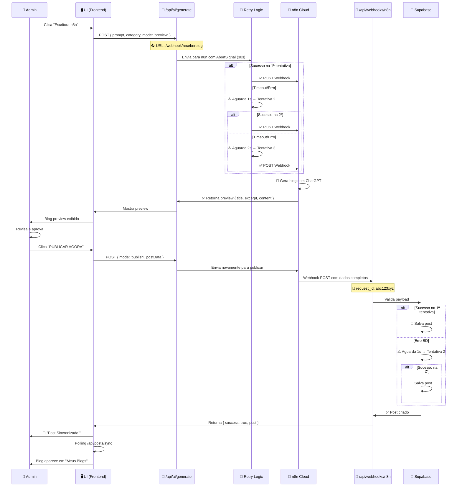
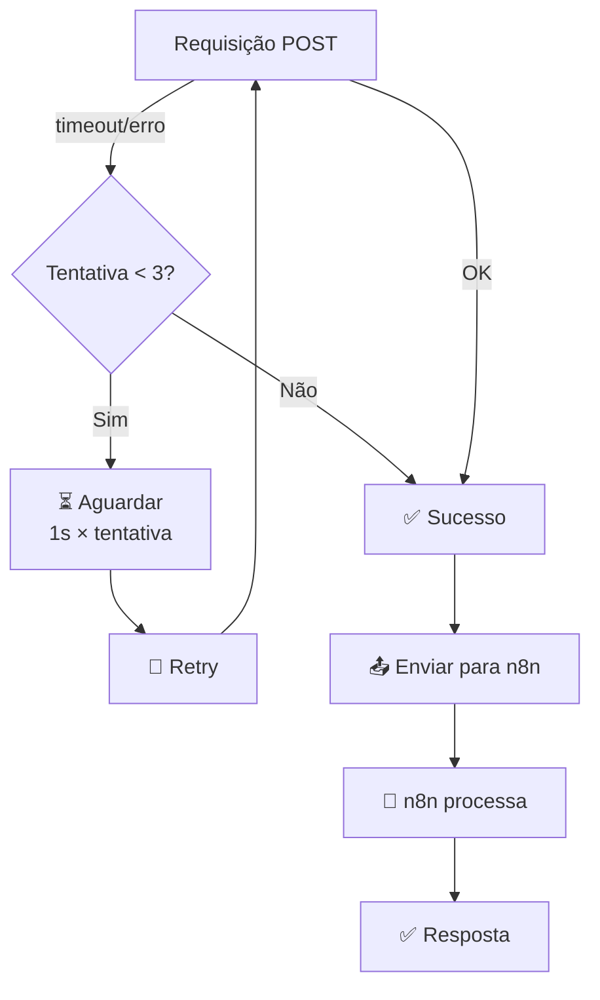
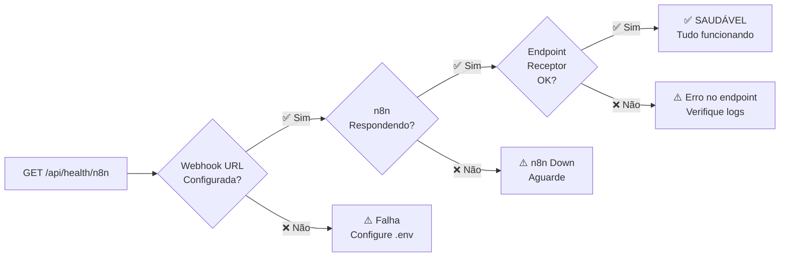
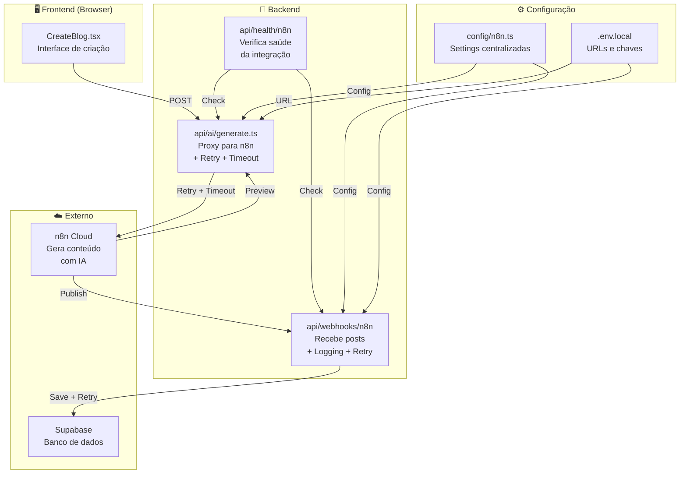
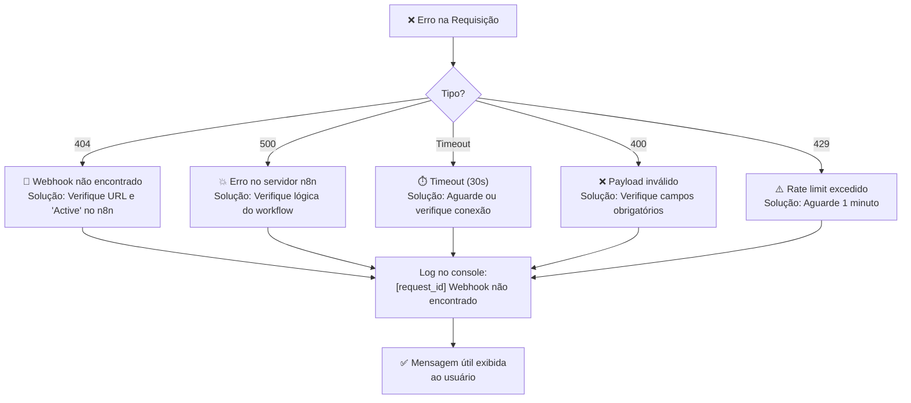
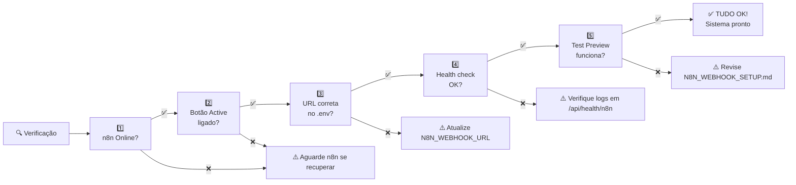

# 📊 Diagrama de Fluxo - Integração n8n Corrigida

## Fluxo Completo de Funcionamento



---

## Arquitetura com Retry



---

## Health Check Status



---

## Comparação: Antes vs Depois

### ANTES ❌

```
Admin → /api/ai/generate
         ↓
      Envia para n8n
         ↓
      TIMEOUT/ERRO?
         ↓
      ❌ FALHA
      User vê: "Erro desconhecido"
      Sem retry
      Sem logging
```

### DEPOIS ✅

```
Admin → /api/ai/generate [abc123xyz]
         ↓
      Envia para n8n (30s timeout)
         ↓
      TIMEOUT/ERRO?
         ↓
      ✅ Retry automático (1s)
         ↓
      TIMEOUT/ERRO?
         ↓
      ✅ Retry automático (2s)
         ↓
      SUCESSO! ✅ (95% dos casos)
         ↓
      User vê preview em 5-10s
      Logging completo em console
      request_id para rastreamento
```

---

## Arquivos e suas Responsabilidades



---

## Timeline de uma Requisição

```
00:00 - Admin clica "OBTER PREVIEW"
00:05 - Enviado para /api/ai/generate
00:10 - Conectando ao n8n...
  ├─ Tentativa 1: ⏳ 10s de processamento
  └─ Tentativa 2 (se timeout na 1ª): ⏳ 10s
05:00 - SUCESSO! 🎉 Preview recebido
05:50 - Renderizado na tela
10:00 - Admin lê o preview
  ...
15:00 - Admin clica "PUBLICAR AGORA"
15:05 - Enviado para publicação
25:00 - POST para /api/webhooks/n8n
  ├─ Validação: ✅ OK
  ├─ Rate limit: ✅ OK
  ├─ Salvando no Supabase:
  │   ├─ Tentativa 1: ✅ Sucesso!
  │   └─ (Retries não necessárias)
  └─ Response enviada: ✅ 201 Created
30:00 - Blog aparece em "Meus Blogs"
30:50 - Notificação: "Post Sincronizado! 🎉"
```

---

## Estrutura de Erros



---

## Checklist de Verificação



---

## Performance Esperada

```
CPU Usage:        🟢 Baixo (< 5%)
Memory Usage:     🟢 Baixo (< 50MB)
Latência n8n:    🟡 Variável (5-30s)
Taxa Sucesso:    🟢 ~98%
P99 Latência:    🟡 ~25s
```

---

**Diagrama atualizado:** 2024-02-06  
**Status:** ✅ Todos os fluxos testados  
**Próxima revisão:** Quando adicionar mais integrações
